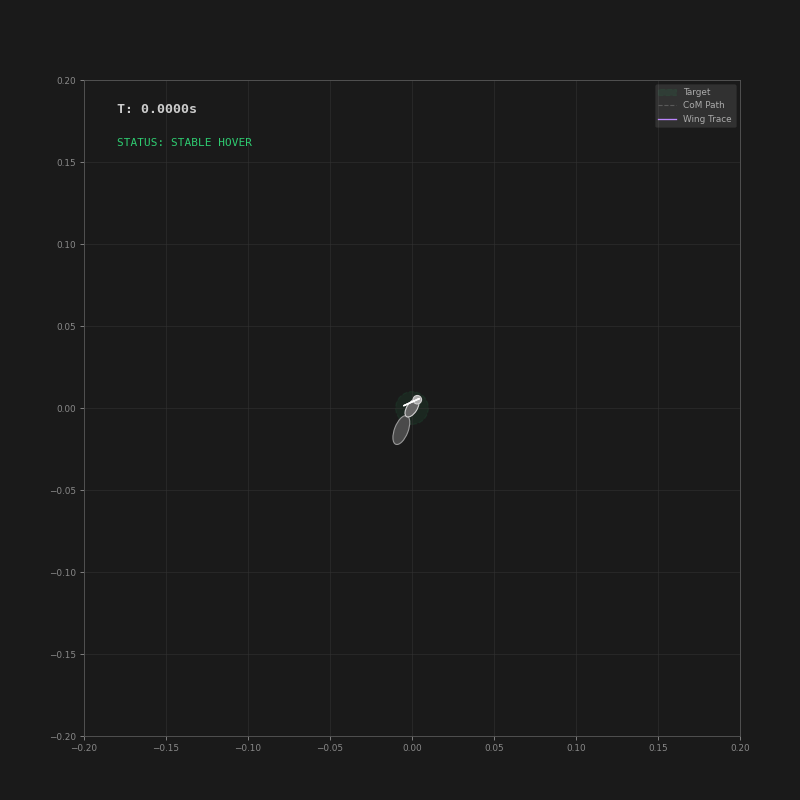

# HornetRL: Differentiable Neuromechanical Flight Optimization

| **Single-Agent Gust Recovery** | **Swarm Morphological Robustness** |
| :---: | :---: |
|  |  |
| *Real-time visualization of articulated thorax-abdomen dynamics and wingbeat traces (purple). Re-stabilizes from a discrete gust within 150ms.* | *Convergence of $N=20$ agents with randomized mass $[0.8M - 1.2M]$ and initial pitch to a 1cm target zone.* |

**HornetRL** is a JAX-based computational framework for **aerial robophysics**. It unifies differentiable multi-body dynamics, unsteady aerodynamics, and neuromorphic policy synthesis to generate robust flight behaviors for biomimetic insect models.

Key features include:
* **Lyapunov-Stable Policy Architecture:** Uses Input Convex Neural Networks (ICNN) within an **IDA-PBC** framework to guarantee physical consistency and closed-loop stability.
* **Differentiable Neuromuscular Interface:** A Central Pattern Generator (CPG) that maps neural commands to wing kinematics using **analytic Jacobians** (via `jax.jacfwd`).
* **Hybrid Dynamics Simulation:** Couples Port-Hamiltonian Multi-body dynamics with a data-driven fluid surrogate, utilizing **adaptive time-dilation** to reconcile training vs. physics timescales.
* **Differentiable Trajectory Optimization:** Implements Short-Horizon Actor-Critic (SHAC) for analytical gradients backpropagation.
* **Evolutionary Curriculum:** Integrated Population Based Training (PBT) automatically evolves reward manifolds to dynamically balance competing objectives.
* **Sim-to-Real Robustness:** Implements **Domain Randomization** across inertial properties, geometric tolerances, and actuation dynamics, enhancing policy resilience against unmodeled dynamics and parameter variability.

### 🎓 Try it now
Run the full training demo in your browser with zero setup:

[](https://colab.research.google.com/github/lhooz/hornetRL/blob/main/notebooks/demo_train.ipynb)

## 📂 Project Structure

```text
hornetRL_repo/                <-- Repository Root
├── hornetRL/                 <-- Main Package
│   ├── __init__.py           # Package initialization
│   ├── fluid_surrogate.py    # ResNet surrogate for unsteady aerodynamics
│   ├── fly_system.py         # Port-Hamiltonian Multi-body dynamics
│   ├── neural_cpg.py         # Oscillator with Neuromuscular Kinematic Interface
│   ├── neural_idapbc.py      # ICNN Energy-Shaping Policy
│   ├── env.py                # Multirate Environment Wrapper
│   ├── pbt_manager.py        # Evolutionary weight adaptation
│   ├── train.py              # SHAC Training Loop
│   ├── inference_hornet.py   # Visualization & Telemetry
│   └── fluid.pkl             # Pre-trained fluid dynamics weights
├── notebooks/                <-- Demo Notebooks
│   └── demo_train.ipynb      # Colab-ready training script
├── pyproject.toml
└── README.md

```

---

## 🚀 Installation

### 1. Local Installation

Clone the repository and install it in editable mode:

```bash
git clone https://github.com/lhooz/hornetRL.git
cd hornetRL
pip install -e .

```

### 2. Google Colab Installation

You can install directly from GitHub inside a Colab notebook:

```python
!pip install git+https://github.com/lhooz/hornetRL.git

```

---

## 🏋️‍♂️ Training

The training pipeline leverages JAX's lax.scan to unroll physics gradients over a horizon, enabling highly sample-efficient learning compared to standard RL baselines.

**Run on CPU:**

```bash
python -m hornetRL.train

```

**Run on GPU:**

```bash
python -m hornetRL.train --gpu

```

**Save checkpoints to a specific folder (e.g., Google Drive):**

```bash
python -m hornetRL.train --gpu --dir "/content/drive/MyDrive/Hornet_Dev"

```

> **Note:** Checkpoints are saved as `shac_params_{STEP}.pkl`.

---

## 🎬 Inference & Visualization

To visualize a trained policy, run the inference module.

```bash
python -m hornetRL.inference_hornet --checkpoint checkpoints_shac/shac_params_1000.pkl

```
This will generate a high-resolution `.gif` showcasing the **articulated Thorax-Abdomen dynamics** and the **wing motion trace**, alongside the **gust recovery maneuver**.

If you do not provide a checkpoint, it will attempt to find the latest one in the default `checkpoints_shac/` folder.

---

## ⚙️ Configuration

The simulation employs a **multirate substepping scheme** to capture high-frequency fluid dynamics while maintaining a tractable control horizon.

| Parameter | Value | Description |
| --- | --- | --- |
| **Physics Frequency** | ~33.3 kHz | High-resolution integration (`3e-5`s dt) |
| **Control Frequency** | ~460 Hz | Policy updates every 72 physics steps |
| **Wingbeat Frequency** | 115 Hz | Nominal operating point for the CPG |
| **Substeps** | 72x | Physics ticks per Neural inference |

Parameters can be adjusted in `hornetRL/train.py` (Optimization) and `hornetRL/fly_system.py` (Morphology).

## 📦 Dependencies

* [JAX](https://github.com/google/jax)
* [DM-Haiku](https://github.com/deepmind/dm-haiku)
* [Optax](https://github.com/deepmind/optax)
* [Matplotlib](https://matplotlib.org/)
* [NumPy](https://numpy.org/)

## 📄 License
This project is licensed under the MIT License - see the [LICENSE](LICENSE) file for details.

## 🖊️ Citation

If you use this project in your research, please cite it using the following BibTeX entry:

```bibtex
@software{HornetRL2026,
  author = {Li, Hao},
  title = {HornetRL: Differentiable Neuromechanical Flight Optimization},
  version = {0.2.0},
  year = {2026},
  url = {https://github.com/lhooz/hornetRL}
}
```

## 📧 Contact

For questions or collaboration, please contact **Hao Li** at `haoli26@buaa.edu.cn`.